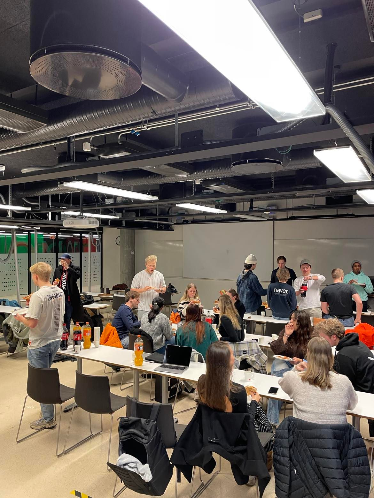

# Bedpres



En dag skjer det vi alle har ventet på: nettsiden til vårt kjære Navet er under renovasjon, og denne gangen er det ingen ringere enn gutta i [Decidable A/S](https://decidable.no/) som har fått det ærefulle oppdraget. Selv om dette er vel og bra, har foreningen fått et nytt problem å bryne seg på: hvordan skal man registrere deltakere på bedriftspresentasjoner i mellomtiden?

Etter et vellykket hastemøte blir det konkludert med at alle bedriftspresentasjoner flyttes til Simula, slik at Cornelia kan stå utenfor og registrere folk. Dette medfører at man holder seg til first-come-first-served-prinsippet, og man unngår også at folk melder seg av i siste liten.

Spente og engasjerte studenter flokker seg gruppevis til! Siden de er solidariske medstudenter, velger de å stå over om ikke hele gruppa får komme inn om gangen, noe som _kan_ føre til problemer, med tanke på auditoriets kapasitet. Ettersom prikk-systemet også er borte, kan man ikke bli med etter at bedpresen har startet.

Gitt at `n` grupper kommer, og at det er plass til `m` personer på Simula om gangen (ikke inkludert bedriften), hvor mange grupper går glipp av bedriftspresentasjonen?

### Input
Input starter med to heltall `n` og `m`, antall grupper og kapasiteten til Simula. Deretter følger `n` heltall: antall personer i hver gruppe. Blant de `n` linjene finner man ett tilfelle av `Cornelia laaser doera`, som signaliserer at bedpresen har startet, og at ingen flere grupper får komme inn

### Output
Antall grupper som gikk glipp av bedriftspresentasjonen.

### Sample input
```
10 7
1
9
2
3
5
Cornelia laaser doera
2
3
```

### Sample output
```
2
```