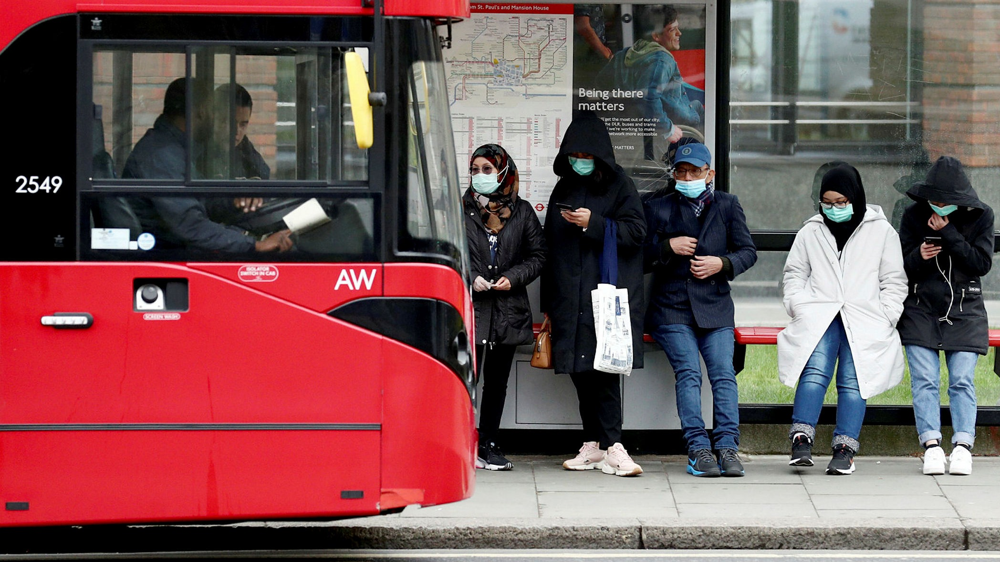

# IFI skitur 1



Etter et års hiatus er IFI skitur endelig tilbake! Etter mye usikkerhet ble det gitt grønt lys, med ett forbehold: folk må kunne fremvise negativ koronatest. For at folk skal slippe å bære med seg så mye unødvendig plast, er det innafor å bare vise et bilde av testen. Ettersom folk er opptatte med obliger og foreningsaktivitet, ender flere med å glemme å teste seg!

Heldigvis har Gyda vært på Nostra-brunch dagen før, og hukommelsen har tatt hovedstøyten. Dermed åpner det seg en mulighet for å dele bildene, og snike med de som ikke rakk å teste seg selv. Den eneste ripen i lakken er at bildene bare kan deles via Bluetooth, så man får dessverre bare sendt bilder til personer på samme buss (folk ble spredt utover da Maja bestilte noen ekstra busser). Gitt at Gyda er i stand til å huske de `n` siste bildene hun har sett, hva er det færreste antallet personer som trenger å teste seg?

### Input
Første linje består av to heltall, `b` og `n`, antall busser som skal avsted, og antall bilder Gyda husker om gangen. Deretter følger `b` linjer bestående av et heltall `p`, antall personer på hver buss.

### Output
Det færreste antallet personer som trenger å teste seg for at alle skal få bli med til Hemsedal.

### Sample input
```
5 3
9
0
5
6
0
```

### Sample output
```
12
```
