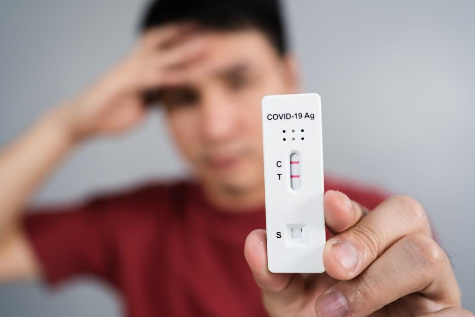

# IFI skitur 2



Etter å ha innsett at bilder av tester var for utrygt, ble det besluttet at alle måtte ha med en fysisk test. I tillegg ble alle flyttet inn i samme buss, for å feire at meteren har blitt opphevet. Du er patologisk opptatt av å lure systemet, og prøver å få til noe ala forrige gang. Ettersom vi alle er søte og sjenerte, og ikke lenger kan gjemme oss bak Bluetooth, vil vi bare dele tester med folk vi kjenner. I og med at alle testene ser identiske ut, blir det denne gangen umulig for Gyda å skille noen tester fra hverandre.

### Input
Input starter med to heltall, `p` og `v`, hvor `p` er antall personer som har sagt at de skal være med, mens `v` er antall vennskap. Deretter følger `v` linjer bestående av to heltall `a` og `b`, som betyr at `a` og `b` er venner.

**NB!** På grunn av det enorme sosiale presset valgte alle personer uten venner å droppe turen i siste liten 😞🤙

### Output
Det færreste antallet personer som trenger å teste seg for at alle skal få bli med til Hemsedal.

### Sample input
```
6 4
0 1
1 2
3 4
4 5
```

### Sample output
```
2
```
