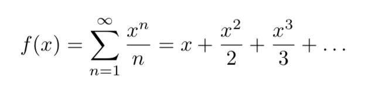

# Siste semester
Ahh, tid for å velge emner til siste semester. Etter å ha jobbet hardt de 5 foregående, velger du å belønne deg selv med et litt chillere semester i innspurten.
Blant bachelorens siste studiepoeng har du utpekt AST1010, et fag uten obliger(!?), til å være det ultimate surfeemnet. Ettersom det ikke har noen obliger, blir
du pent nødt til å ignorere det frem til uka før eksamen.

Idet du en dag i mars scroller gjennom studentweb, går det plutselig kaldt nedover ryggen på deg. Du har ved en uheldig feil valgt MAT3110 istedenfor AST1010, og
ikke nok med det, fagets eneste oblig har frist i dag! Klarer du å ro det i land, eller blir det utsatt bachelor med AST1010 til høsten?

<p align="center">
  
</p>

### Input/Output
Lag en funksjon som tar inn `x` og `N` som parameter, og returnerer summen av rekken opp til N som bildet viser. For ordens skyld er kan du hardkode x til å være 1.

### N = 10
```
2.92
```

### N = 1000
```
7.48
```

### N = 100000
```
12.09
```

***Bonusspørsmål!*** Tror du denne rekken konvergerer (summen blir et endelig tall), eller vil den divergere mot uendelig?
