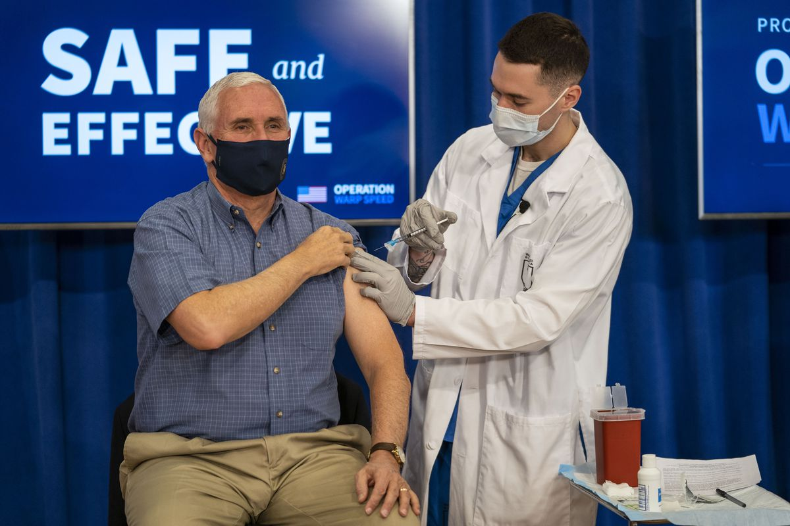

# Vaksiner i ballene 1
Basert på en historie fra en tidligere [fredagsprat](https://www.instagram.com/tv/CV5VD_SjItl/) (spol til 1:06).



<br>

Strømprisene er stadig stigende, aksjemarkedet stuper, og den forrige deltidsjobben din har permittert deg. Med få andre utveier har du valgt å ~~satse på en karriere som pandemiprofitør~~ hjelpe til under pandemien! Ettersom behovet fremdeles er enormt, klarer du å kapre en jobb i helsevesenet, og blir bedt om å sette vaksiner mot CoVid-19.

Du gleder deg til å starte i den nye jobben din, men får plutselig beskjed fra øverste hold om en ny praksis: folk som bruker begge armene like mye må rett og slett få satt vaksinen i ballene. Du stusser litt på det etiske aspektet av dette i starten, men herregud, du tar jo bare ordre! Uansett har dette bra historie-på-vors-potensiale, og du bestemmer deg for at du trenger noen konkrete tall for at folk skal tro på deg..

### Input
Input er en rekke navn og hvorvidt de skal få vaksinen i høyre arm, venstre arm, eller, vel, i ballene.

### Output
Antall personer som får vaksinen i ballene.

### Sample input
```
Einar hoyre
Stian venstre
Christian ballene
Éger venstre
Jakob venstre
Tord ballene
Marius hoyre
```

### Sample output
```
2
```
